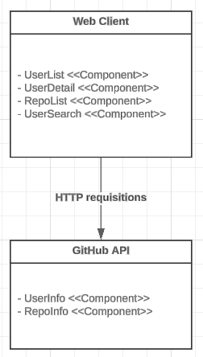

# Github Profile Viewer

# 1. O problema
Diversos gestores e desenvolvedores passam por desconforto ao buscar por informações a cerca de usuários no GitHub de maneira clara e intuitiva, visto que o layout das aplicações existentes para esse propósito possuem layout confuso, o que dificulta a navegação e análise de infromações relevantes.

# 2. A Solução
O github profile viewer é uma aplicação web em REACT.js que permite buscar, listar e visualizar detalhes e repositórios de um usuário do Github. O projeto é capaz de consumir a API do Github e exibir as informações no frontend com REACT.js.

# 2.1. Funcionalidades
- **Listar Usuários:** A aplicação deve exibir uma lista de usuários obtidos da API do GitHub.
- **Busca de Usuários:** A aplicação deve permitir a busca de usuários por nome, login ou título, utilizando a barra de pesquisa
- **Detalhes de Usuário:** Ao selecionar um usuário na lista, a aplicação deve exibir detalhes do usuário, incluindo nome, login, email e link para o perfil do GitHub.
- **Listar Repositórios:** Ao selecionar um usuário, a aplicação deve exibir uma lista dos repositórios desse usuário.

# 3. Arquitetura
O projeto é composto por duas camadas: frontend e backend, este que inclui uma API remota do GitHub. Abaixo segue um diagrama que ilustra a arquitetura do software:

## Vantagens de não conter um componente backend para consumo da API: 
- **Simplicidade:** Menos componentes para gerenciar
- **Performance:** Reduzo a latência, pois a comunicação com a API é direta no frontend

## Desvantagens de não conter um componente backend para consumo da API:
- **Segurança:** Como é observável, a chave de API do GitHub fica exposta no frontend, o que leva a vulnerabilidades da conta do github do desenvolvedor, portanto, é necessário que, ao dar fork no projeto, o cliente gere sua própria chave de API que pode ser obtida da seguinte forma: https://docs.github.com/pt/apps/creating-github-apps/authenticating-with-a-github-app/managing-private-keys-for-github-apps

# 3.1. Frontend
## UX & UI Design
Frequentemente o desenvolvimento de interfaces gráficas é acompanhado por atrasos e retrabalho quando não é acompanhado de boas práticas de design de interface humano computador. Bons designs usam a UX em consideração para desenvolver a UI ao se basear no UCD (Design Centrado no Usuário), de forma que ela seja responsiva, interativa e amigável. Para este projeto, o UX Design foi trabalhado bem sutilmente ao usar como base outras interfaces de buscadores de informação com design amigável e simples de utilizar. O design da interface pode ser visualizado no seguinte link: https://www.figma.com/design/SGEFXM7N7UQ2220jCJ5iQz/GitHub-Profile-Viewer?node-id=0-1&t=WEURuGDAJeq2kvms-1 

## REACT.js
Descrição: A inteface do usuário é desenvolvida com REACT.js, HTML (JSX) e CSS (CSS-in-Js), visando ser atraente, intuitiva e responsiva. 

## Bootstrap
Descrição: O framework foi utilizado para agilizar no desenvolvimento da interface, visto que possui layouts responsivos e customizáveis.

# 3.2. Backend
Descrição: A API REST do github possui **serviços** de **busca por informações** do usuário e **informações do repositório** do usuário.
Ref: https://docs.github.com/pt/rest/quickstart?apiVersion=2022-11-28

# 3.3.  Pacotes e Bibliotecas
Ambiente Dev:
- nvm -v: 0.39.7
- node -v: v20.14.0 (LTS)
- npm -v: 10.7.0

Demais pacotes:
- Octokit.js: é o SDK recomendado pelo GitHub para interagir com a API REST seguindo as melhores práticas, oferecendo uma interface simplificada e suporte em todos os navegadores modernos. Ref: https://docs.github.com/pt/rest/guides/scripting-with-the-rest-api-and-javascript?apiVersion=2022-11-28
- React Router Dom: É um pacote que permite criar rotas entre interfaces no projeto. Ref: https://reactrouter.com/en/main

# 4. Testes e Resultados
A aplicação foi testada em diferentes navegadores e os resultados foram...
